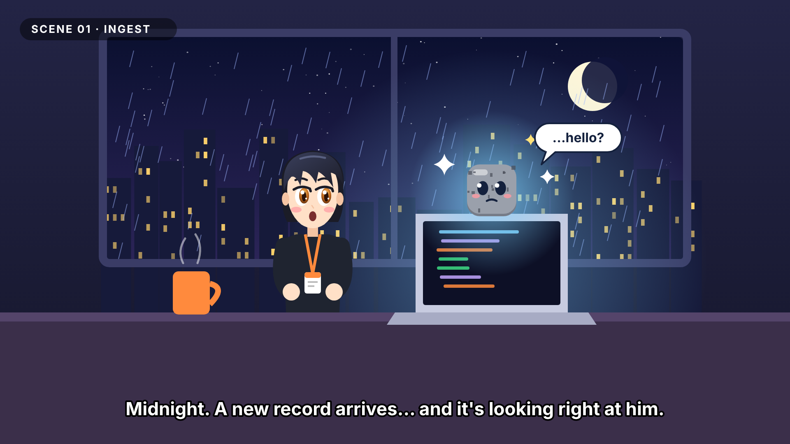
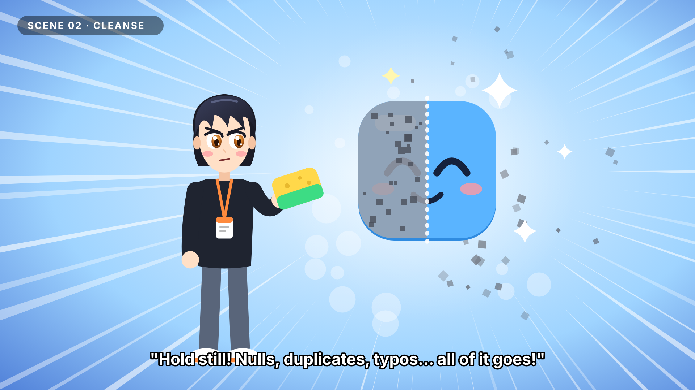
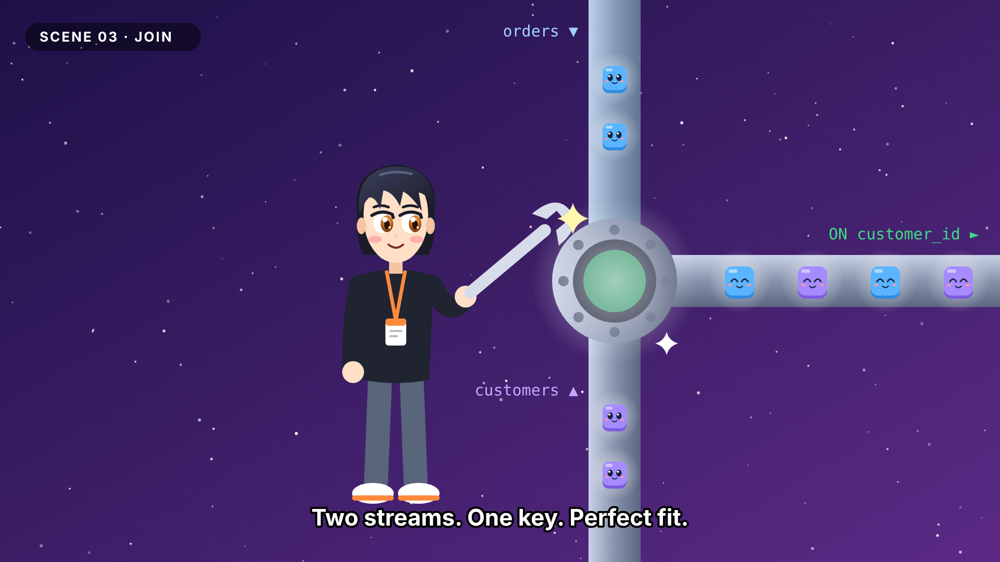
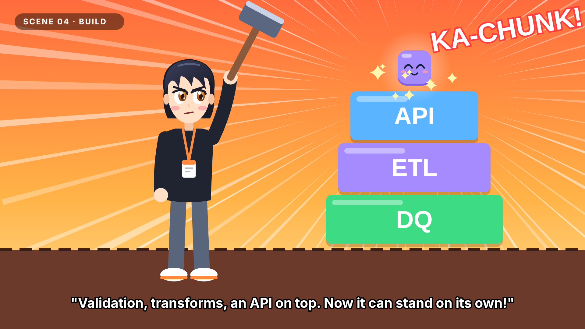
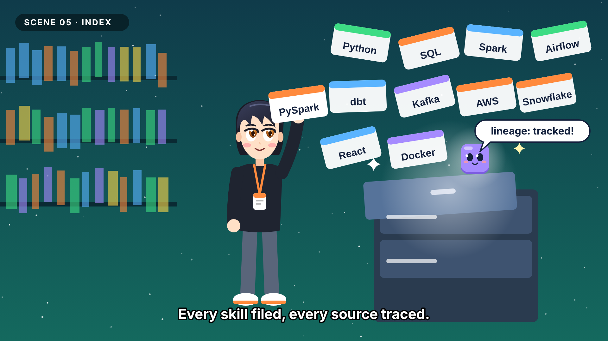
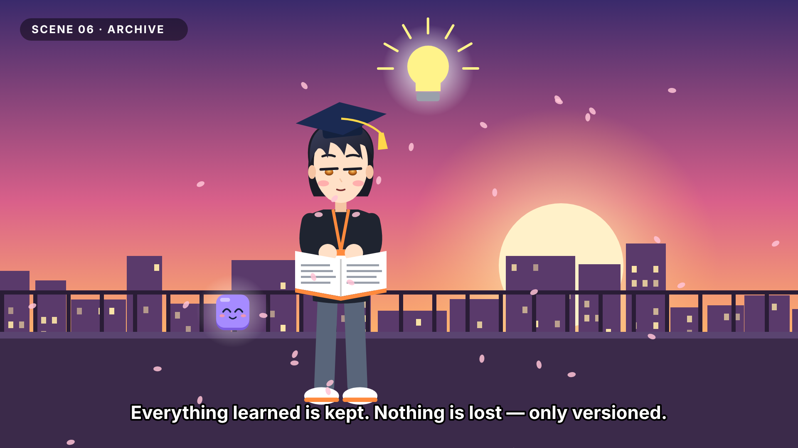
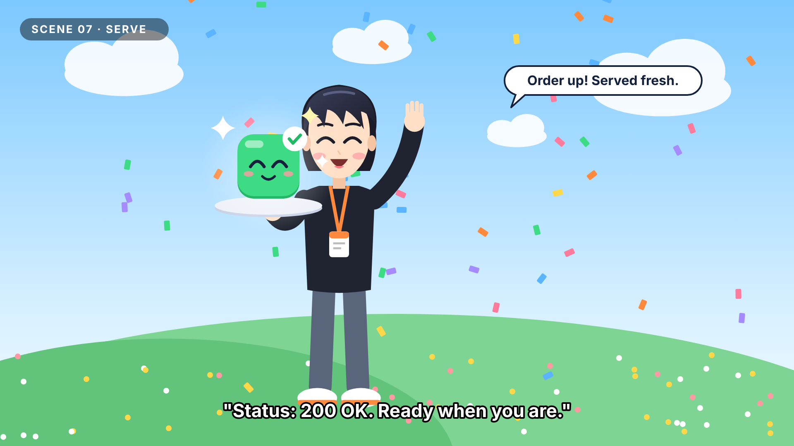
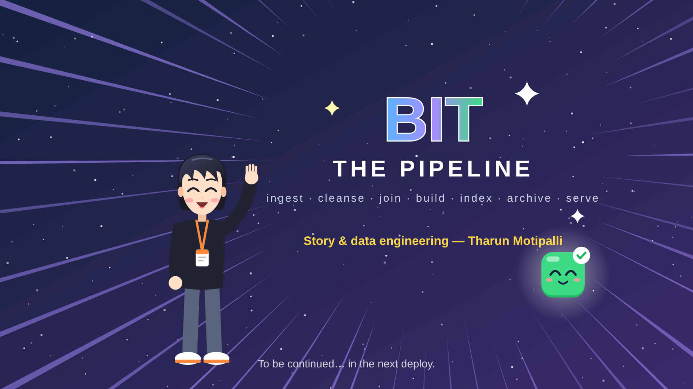

# BIT: THE PIPELINE — Anime Short

**Format:** 2D anime short · 16:9 · 1920×1080 · 24 fps
**Runtime:** about 2 min 30 s
**Characters:** **The Engineer** (Tharun) and **Bit**, the data packet (both from the portfolio's design spec)
**Keyframes:** `anime/scenes/scene-01.png` … `scene-08.png` (editable SVG sources next to them)

---

## Characters

| Character | Look | Personality | Voice |
|---|---|---|---|
| **The Engineer** | Swept black fringe, amber eyes, black long-sleeve top, orange lanyard badge, slate trousers, white sneakers with orange soles | Calm, focused, quietly funny; goes all-in when there's a problem to fix | Warm mid-range, relaxed, gets intense in the action beats |
| **Bit** | Rounded-square data packet with big eyes and rosy cheeks. Colour shows its state: **grey + noisy** (raw) → **blue** (clean) → **purple** (curated) → **green with a ✓** (served) | Curious, nervous at first, then proud | High, small, chirpy; speaks in short lines |

**Colour script:** night indigo → bright cyan → cosmic violet → hot orange → deep teal → sunset pink → morning sky → starry finale.

---

## SCENE 01 · INGEST — "Midnight Arrival" (0:00–0:22)

**INT. ENGINEER'S ROOM — NIGHT.** Rain on a tall window, city lights blinking. A mug of coffee steams.

| Shot | Time | Camera | Action | Audio |
|---|---|---|---|---|
| 1A | 0:00–0:05 | Slow push-in through the rainy window | City skyline, crescent moon, rain streaks | Rain ambience, soft lo-fi piano |
| 1B | 0:05–0:10 | Medium shot | The Engineer types. Code lines in blue, orange and green scroll on the laptop | Keyboard clicks, a mug set down |
| 1C | 0:10–0:15 | Close-up on the laptop | The screen bulges, glows, and a small grey cube pops out with sparkles | *Pop!* plus a rising chime |
| 1D | 0:15–0:22 | Two-shot, as in the keyframe | Bit blinks. The Engineer freezes mid-keystroke, mouth open | — |

> **BIT** *(tiny, nervous)*: …hello?
> **ENGINEER** *(blinking)*: …You're the new record?
> **BIT**: I think so. I feel… messy.
> **NARRATOR (subtitle):** *Midnight. A new record arrives… and it's looking right at him.*

---

## SCENE 02 · CLEANSE — "Scrub Mode" (0:22–0:42)

**INT. ABSTRACT CLEANING SPACE — WHITE-BLUE BURST.** Anime speed lines and soap bubbles.

| Shot | Time | Camera | Action | Audio |
|---|---|---|---|---|
| 2A | 0:22–0:26 | Close-up on the Engineer's eyes, which sharpen | Hair whips, a determined brow. A transformation-style flash | Whoosh, rising synth |
| 2B | 0:26–0:34 | Wide action shot, as in the keyframe | He scrubs a giant Bit with a sponge. Grey noise specks (nulls, duplicates, typos) fly off. Bit is half grey, half bright blue | Squeaky scrub sounds, bubbles popping |
| 2C | 0:34–0:42 | Bit fills the frame | The last speck pops off; Bit shines fully blue and closes its eyes in a happy smile | Sparkle chime |

> **ENGINEER:** Hold still! Nulls, duplicates, typos… all of it goes!
> **BIT** *(giggling)*: That tickles!
> **BIT** *(shining)*: Whoa… I'm *clean*.

---

## SCENE 03 · JOIN — "Two Streams, One Key" (0:42–1:02)

**EXT. COSMIC PIPEWORKS — STARFIELD.** Huge chrome pipes float in a violet galaxy.

| Shot | Time | Camera | Action | Audio |
|---|---|---|---|---|
| 3A | 0:42–0:48 | Tilt down the vertical pipe | Blue packets labelled `orders` slide down; purple `customers` packets rise from below | Low hum, flowing-water whoosh |
| 3B | 0:48–0:55 | Medium shot | The Engineer locks a giant wrench onto the junction and turns. The bolts glow green | Heavy *clunk-clunk-CLICK* |
| 3C | 0:55–1:02 | Track right along the output pipe | Blue and purple packets pair up and flow out happily, `ON customer_id ►` | Harmonised chime as each pair meets |

> **ENGINEER:** Orders on the left, customers on the right…
> **ENGINEER** *(final turn)*: …matched on `customer_id`. Perfect fit.
> **BIT** *(now purple, curated)*: I've got friends now!

---

## SCENE 04 · BUILD — "KA-CHUNK!" (1:02–1:22)

**EXT. CONSTRUCTION SITE — BLAZING ORANGE SKY.** Shonen-style action panel.

| Shot | Time | Camera | Action | Audio |
|---|---|---|---|---|
| 4A | 1:02–1:06 | Low angle, hero shot | The Engineer raises a hammer overhead. Speed lines radiate | Taiko drum hit |
| 4B | 1:06–1:12 | Smash cut ×3 | **DQ** block lands, then **ETL**, then **API**, each with a hammer strike and sparks | *KA-CHUNK!* ×3, the screen shakes on each |
| 4C | 1:12–1:22 | Slow pull-back, as in the keyframe | Bit hops onto the top of the stack, surrounded by sparkles | Triumphant brass sting |

> **ENGINEER:** Data quality first. Then the transforms. API on top.
> **ENGINEER** *(last swing)*: Now it can stand on its own!
> **SFX TITLE CARD:** **KA-CHUNK!**

---

## SCENE 05 · INDEX — "The Skill Library" (1:22–1:42)

**INT. INFINITE LIBRARY — DEEP TEAL.** Glowing shelves, skill cards floating like leaves.

| Shot | Time | Camera | Action | Audio |
|---|---|---|---|---|
| 5A | 1:22–1:28 | Slow drift through the floating cards | Cards: Python, SQL, Spark, Airflow, dbt, Kafka, AWS, Snowflake, React, Docker | Soft harp arpeggio |
| 5B | 1:28–1:36 | Medium shot | The Engineer reaches up and plucks the **PySpark** card. The cabinet drawer slides open by itself and the card drops in | Paper flutter, drawer *shhk*, *ding* |
| 5C | 1:36–1:42 | Close-up on Bit | Glowing threads link each card back to the scenes where it was used (lineage) | Shimmer |

> **BIT:** Lineage: tracked!
> **ENGINEER:** Every skill filed. Every source traced.

---

## SCENE 06 · ARCHIVE — "Golden Hour" (1:42–2:05)

**EXT. ROOFTOP — SUNSET.** Pink-orange sky, cherry petals drifting, city silhouettes.

| Shot | Time | Camera | Action | Audio |
|---|---|---|---|---|
| 6A | 1:42–1:50 | Wide establishing shot | The sun sinks behind the city. Petals blow across the frame | Wind, a slow emotional piano theme |
| 6B | 1:50–1:58 | Medium shot, as in the keyframe | The Engineer, in a graduation cap, reads a book. The tassel swings in the wind. Quick flashback inserts of the earlier scenes play on the turning pages | Page flips |
| 6C | 1:58–2:05 | Insert | A light bulb flickers on above his head. Bit, resting on the railing, smiles | *Ting!* |

> **ENGINEER** *(quiet voice-over)*: Every course, every project, every late-night bug…
> **ENGINEER:** Everything learned is kept. Nothing is lost — only versioned.

---

## SCENE 07 · SERVE — "Order Up!" (2:05–2:22)

**EXT. GRASSY HILL — BRIGHT MORNING.** Blue sky, fluffy clouds, confetti.

| Shot | Time | Camera | Action | Audio |
|---|---|---|---|---|
| 7A | 2:05–2:10 | Sunrise whip-pan | Day breaks over the hill | Birdsong, the upbeat main theme kicks in |
| 7B | 2:10–2:17 | Medium shot, as in the keyframe | The Engineer holds out a tray. Bit, now **green with a ✓**, bounces on it. Confetti bursts | Confetti pop, crowd *yay* |
| 7C | 2:17–2:22 | Push-in on the Engineer | He waves straight at the camera, at the viewer | — |

> **ENGINEER** *(grinning)*: Order up! Served fresh.
> **BIT:** Status: 200 OK!
> **ENGINEER** *(to camera)*: Ready when you are.

---

## SCENE 08 · END CARD — "To Be Continued" (2:22–2:30)

**TITLE CARD — STARFIELD.** The logo **BIT: THE PIPELINE** slams in with speed lines. The stage list fades in underneath.

> **BIT** *(off-screen)*: Next episode… streaming!
> **TEXT:** *To be continued… in the next deploy.*
> **CTA overlay (optional):** portfolio URL · "Hire the engineer" button

**Music:** the main theme resolves on a final chord, then one last Bit *blip*.

---

## Production notes

- **Animating the keyframes:** each SVG is built from separate groups (characters, props, backgrounds), so it can be imported into After Effects, Rive, Lottie (via SVG), or the site's own Framer Motion setup to animate the loops listed in `DESIGN.md` §7.
- **Image-AI prompts:** to repaint any keyframe in a full anime style (Midjourney, SDXL, etc.), start from:
  `anime key visual, young male software engineer with swept black hair and amber eyes, black long-sleeve shirt with orange lanyard badge, cute glowing cube mascot with big eyes, [scene setting], cel shading, vibrant lighting, Makoto Shinkai-style sky, 16:9`
  Use the PNG as the image reference so both characters stay on model.
- **Voice:** two voice actors (Engineer, Bit) plus an optional narrator for the subtitle lines. Bit's voice can be pitch-shifted (+5 semitones).
- **Regenerating art:** `python3 anime/generate_scenes.py` and then `node anime/render_png.cjs`. The renderer needs the `playwright` package; set `NODE_PATH` to where it's installed if it's global.
