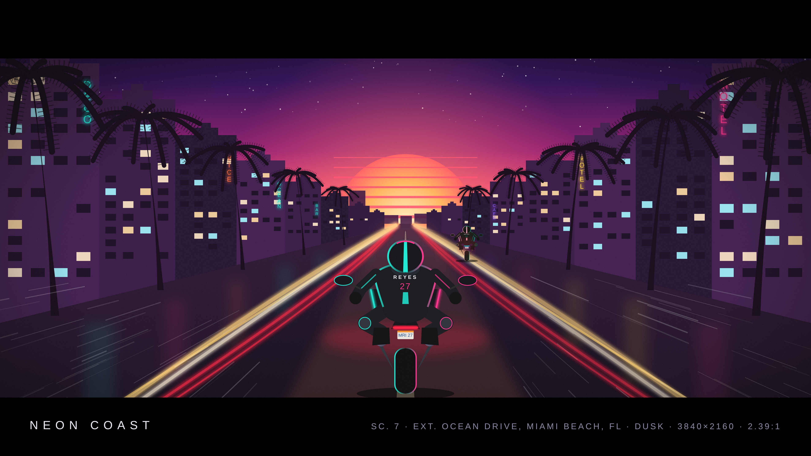
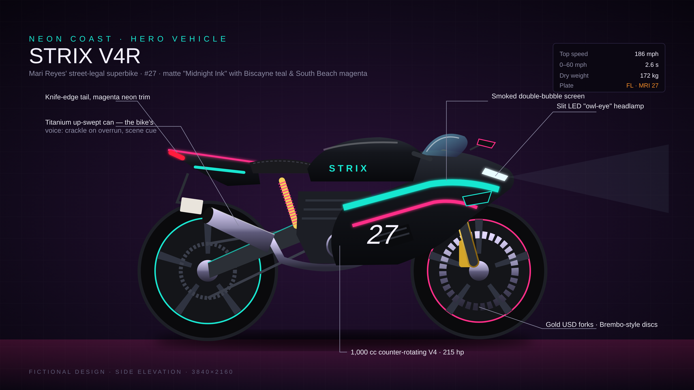
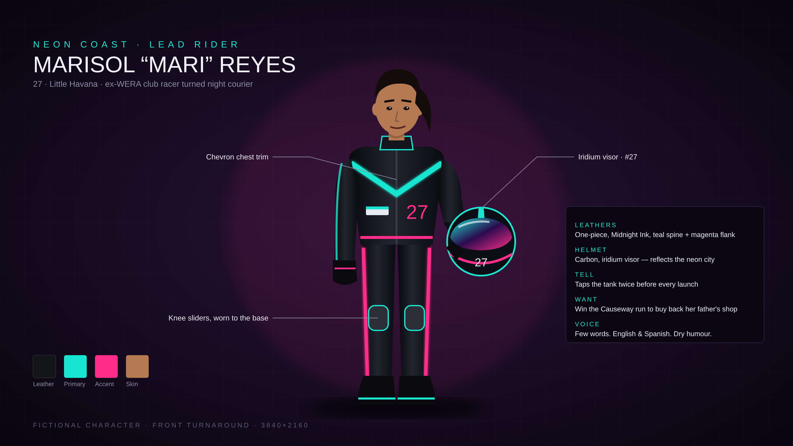
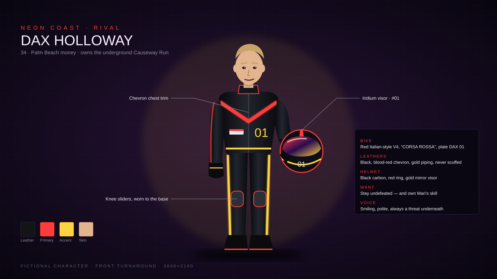

# NEON COAST — racing bike short film pack

A cinematic street-racing short set in Miami, Florida: a script, a 4K key frame,
and design sheets for the hero bike and both riders. Everything here is fictional.

| File | What it is |
|------|------------|
| [`SCRIPT.md`](SCRIPT.md) | Full screenplay (9 scenes, ~6 min), shot list, and production and colour notes |
| [`art/scene_ocean_drive.png`](art/scene_ocean_drive.png) | 3840×2160 key frame, Ocean Drive at dusk, 2.39:1 letterbox |
| [`art/bike_strix_v4r.png`](art/bike_strix_v4r.png) | Hero bike design sheet, Strix V4R #27 |
| [`art/character_mari_reyes.png`](art/character_mari_reyes.png) | Lead rider character sheet |
| [`art/character_dax_holloway.png`](art/character_dax_holloway.png) | Rival character sheet |






## Editing the art

Every image is vector (`art/*.svg`) and renders to a 4K PNG.

```bash
python3 src/gen_scene.py        # rebuilds art/scene_ocean_drive.svg
python3 src/gen_characters.py   # rebuilds both character sheets
node src/render.mjs             # renders every art/*.svg to a 3840x2160 PNG (needs playwright)
```

The bike sheet (`art/bike_strix_v4r.svg`) is hand-written SVG, so edit it directly.
